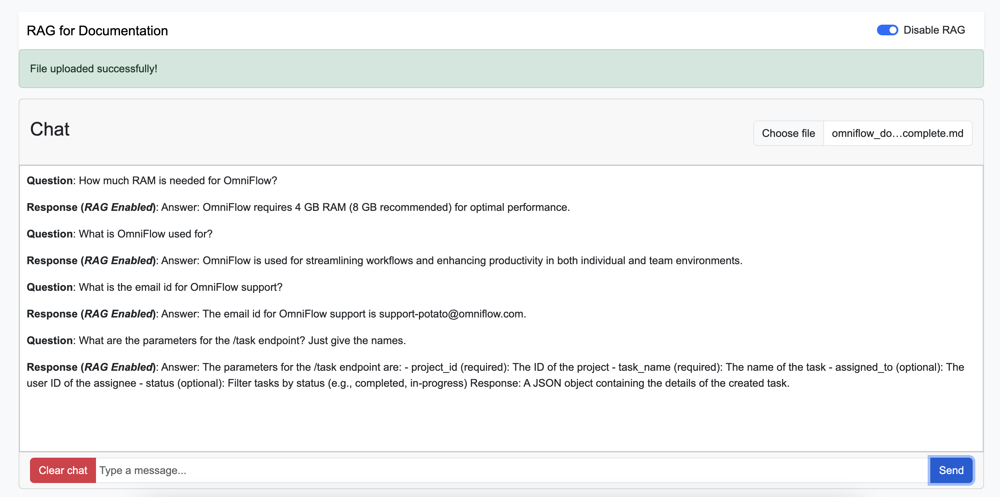
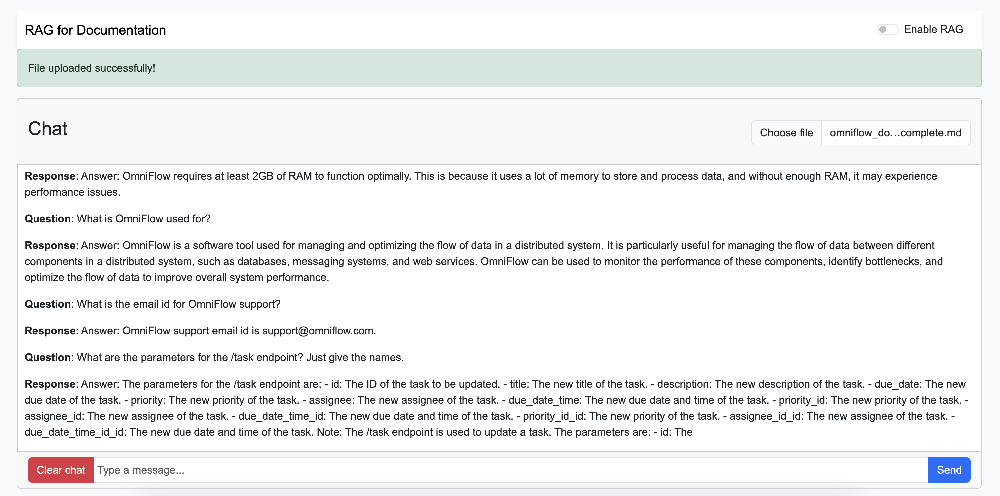

# [WIP] RAG on Markdown Documentation

This project is a prototype for building a RAG system, that can take in proprietary documentation in Markdown format, and use that to fine tune LLM responses.

## To Dos
- [x] Build everything as a Web server that accepts documents from the User and allows working on them.
- [ ] Build a Web UI
  - [ ] Disable upload button once uploaded
- [ ] Implement vectorization and semantic search natively (for research purposes)
  - [ ] Eventually make the system dependency free
- [ ] Test the system with different LLMs / Provide users a choice of the model to use

## How to use
This project is still under development, as such everything feels very basic right now.

To run the project on your system:
1. Clone the repo.
2. `pip install -r requirements.txt`
3. `cd server`
4. `python app.py`
5. Open `localhost:5000` in your web browser.
6. Upload a **Markdown** file.
   1. Once it's done uploading and the model is ready, you should see the following message: "File uploaded successfully, preparing LLM..."
7. Click **Enable RAG** to enable the RAG functionalities.
8. Use the Chat UI to ask questions about the document.
   1. Since the model would be running locally, you might notice that the responses take some time to generate. Please be patient.

## Evaluation

Here are the differences on running the model with and without RAG enabled.

### RAG Enabled

### RAG Disabled

If you compare the answers to the documentation uploaded (present at `server/uploads/omniflow_documentation_complete.md`), it is clear that the RAG Enabled model performs much better and is far more accurate!